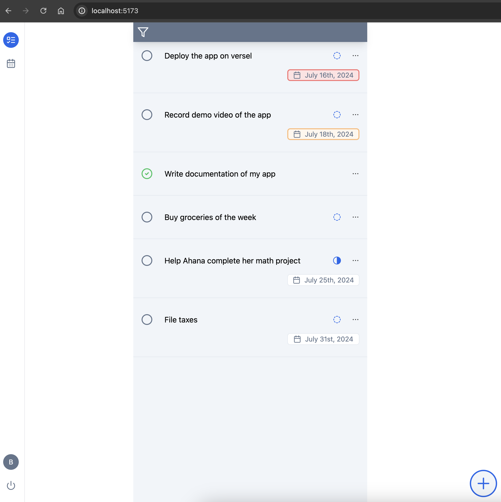

# ToDo Application Frontend

This is the frontend of the ToDo application built using **React**, **TypeScript**, **Vite**, **Shadcn**, and **TailwindCSS**. The application provides a user-friendly interface for managing tasks.

## Table of Contents

- [ToDo Application Frontend](#todo-application-frontend)
  - [Table of Contents](#table-of-contents)
  - [Features](#features)
  - [Installation](#installation)
  - [Running the Application](#running-the-application)
  - [Screenshots](#screenshots)

## Features

- **Task Management**: Create, update, and delete tasks with ease.
- **Task Operations**: Mark Complete, Set Due Date, Set Progress
- **Authentication**: Secure login and registration system.
- **Responsive Design**: Optimized for both desktop and mobile devices.
- **User Profile**: Manage user information and settings.
- **Filters**: Easily filter tasks to stay organized.
- **Real-time Updates**: Automatically updates the task list in real-time.

## Installation

1. Install and Run the API server of the application by cloning and following steps on this repo
    ### [Clone and Run the API](https://github.com/bjspatel/todo-api)

2. Clone the repository:
    ```sh
    git clone https://github.com/bjspatel/todo-frontend.git
    cd todo-frontend
    ```

3. Install the dependencies:
    ```sh
    npm install
    ```

## Running the Application

1. Create a `.env` file in the root directory of the project and add the following environment variables:
    ```env
    VITE_API_URL=http://localhost:8080
    ```

2. Start the application:
    ```sh
    npm run dev
    ```

3. The application will be running on `http://localhost:5173`.

## Screenshots


